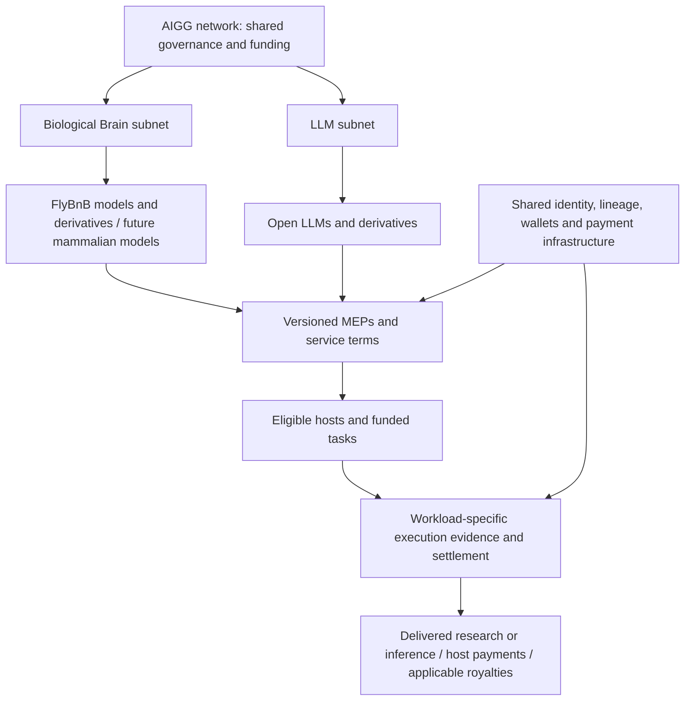
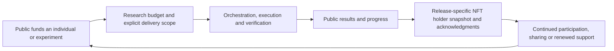

# aigg: An Open Network for Model Computation and Verifiable Research

## System White Paper and Roadmap

**Version:** v0.2.1 · Discussion draft

**Date:** 2026-09-20

**Original brain implementation baseline:** `aigg-bnb` main at [`09c9de9`](https://github.com/jianmliu/aigg-bnb/tree/09c9de9)

**Revision evidence:** This revision additionally draws on source inspection of `aigg-bnb` at `dd03b3f`, `aigg-mep` at `c6bdd28`, and `aigg-src` at `4100220`. The original baseline remains attached to historical capability statements. Source inspection does not establish deployment status. The two-subnet organization and cross-repository integration below are proposed architecture.

**Scope:** System architecture, delivery guarantees, public research funding, governance, and milestones. This document does not replace the protocol specification or equate testnet operation with production security validation.

This document distinguishes four states: **implemented** means the baseline code contains the capability; **testnet operation recorded** means the repository documents an actual run, not that this review independently reverified the live deployment; **branch implementation** means the capability has not entered the baseline main branch; and **planned** means implementation or validation remains outstanding. Financial flows, performance, and deployment parameters must be tied to a specific code version and deployment. Roadmap milestones define acceptance criteria, not calendar delivery commitments.

## Abstract

aigg aims to make model computation discoverable, executable, checkable, and payable across an open provider network. Requesters submit tasks, providers hold models and supply computation, and the system records task conditions, results, and the guarantees attached to them while handling payment, timeouts, and disputes.

The project began by extending unified model APIs, such as sub2api, toward P2P inference supply. Establishing confidence in unfamiliar providers led to an execution-assurance path based on trusted execution environments (TEEs). The entry barriers to GPU TEEs, together with the difficulty of verifying general LLM inference bit for bit across heterogeneous environments, prompted a search for another class of workload: models with precisely defined execution rules that ordinary devices can run and independent parties can recompute.

Integer simulation of the fruit-fly connectome became the first application to exercise the full computation path. Browser tabs lower the barrier to participation; PoRW evidence of model possession supports provider eligibility; task-level redundant execution and dispute mechanisms support result verification. FlyBnB applies these capabilities to research on simulation robustness under connectome variation and produces an open dataset.

The proposed network organizes this work into a Biological Brain subnet and an LLM subnet. Models and derivatives use versioned MEPs within those subnets, connecting publication, financing, host service, execution evidence and settlement through a common model-service lifecycle. FlyBnB is the first application. Two partnership tracks follow in parallel: mammalian brain models and research collaborations within the Biological Brain subnet, and an open-source model partnership with a bounded inference-credit presale pilot within the LLM subnet. Both require scoped delivery and independent validation.

The system's near-term value does not depend on commercial inference demand. Members of the public can fund particular individuals and experiments, maintain an ongoing relationship with the research, and receive holder acknowledgment through a release-specific NFT ownership snapshot. Results are public, and the snapshot and research evidence can be checked. Paid experiments and other model workloads are subsequent expansion paths.

## 1. The Problem and the Path to the Current Design

A unified API reduces the effort of calling different models, but a common interface does not answer three questions: whether the provider holds the model it claims to serve, whether it completed the task as agreed, and who bears the consequences of failure or a disputed result.

Each stage of the project separated these constraints more clearly:

| Stage | Purpose | Boundary identified |
|---|---|---|
| sub2api → P2P API | Connect a unified entry point to open inference supply | Interface consistency does not prove authentic delivery |
| LLM + TEE path | Provide assurance about the execution environment and program | Depends on hardware, the attestation chain, and the runtime stack; GPU supply has a relatively high entry barrier |
| Addition of PoRW | Provide evidence of model possession and participation eligibility | Possession evidence cannot replace verification of task results |
| Fly brain + browser | Exercise the complete task flow on ordinary devices | First establish one explicit, reproducible execution semantics |
| CPU/GPU execution direction | Separate task and evidence interfaces from device type | GPU performance, proof overhead, and the value of larger models require separate validation |

TEE execution and exact recomputation can coexist. Different tasks can use different delivery guarantees. The system seeks to unify task descriptions, model identities, capability discovery, receipts, and settlement interfaces without treating every guarantee as the same kind of trust.

Extending this architecture to mammals means that larger deterministic models may reuse the same task and dispute principles. It does not mean a complete mammalian connectome is already available, that the current fly implementation has completed its GPU extension, or that a simulation already has the corresponding biological explanatory power.

## 2. One Network, Two Subnets, Multiple Model Profiles

**AIGG is the network and proposed shared governance and funding layer on BNB Chain.** Its initial architecture distinguishes two workload subnets: **Biological Brain** and **LLM**. A subnet coordinates a service family, eligible hosts, acceptance policies, funding, and delivery obligations. It can contain many models and Model Execution Profiles (MEPs); registering a model or derivative does not automatically create another subnet.

| Layer | Biological Brain subnet | LLM subnet |
|---|---|---|
| Applications and models | FlyBnB, synthetic individuals and future mammalian models | Open-source foundation models, finetunes and distilled derivatives |
| Execution profiles | Versioned simulation rules and structural commitments | Model artifacts, runtime, numeric configuration, tokenizer and sampling constraints |
| Host service | Simulation tasks on supported browser, CPU and future GPU runtimes | Inference on compatible hosts; assurance depends on the selected service profile |
| Acceptance and metering | Supported deterministic execution, disputes; simulation steps and redundancy | Versioned inference receipts and acceptance policies; defined inference usage units |
| Funding and obligations | Research funding, NFT purchases and paid experiments | Customer payments and potentially presold inference credits with explicit delivery liabilities |

**FlyBnB is the first application of the Biological Brain subnet and produces a research dataset.** Future mammalian workloads can join that subnet after independent model, resource and verification validation. An LLM and its derivatives can belong to the LLM subnet with distinct profiles, hosts and commercial terms. These are organizational boundaries, not a requirement to deploy a new chain or issue a token for each subnet.

PoRW, execution verification and settlement remain separate mechanisms. Shared infrastructure may provide model identity, lineage references, agent wallets, authorization, payments and contribution records. Each subnet must specify its own execution semantics, evidence, resource units, collateral exposure and service obligations. Shared interfaces do not make those guarantees interchangeable.

`aigg-mep` supplies reusable model and execution-profile primitives; `aigg-porw` supplies possession and supported execution protocols; `aigg-bnb` contains the brain market, BNB integration, Gateway, relayer and application. `aigg-src` supplies the model API and billing infrastructure, with wallet, agent authorization and payment components as integration candidates. Their existence in source does not establish a deployed, unified network.

Launch admission remains restricted: FlyBnB is the initial funded application. Defining the LLM subnet now does not open unrestricted competition for AIGG issuance. Research operators remain accountable for scheduling experiments, reserving budgets and publishing delivery status.

## 3. System Roles

| Role | Responsibility | Rights or guarantees not automatically conferred |
|---|---|---|
| Researcher / requester | Define the question, inputs, budget, and acceptance criteria | Correct execution does not establish a research hypothesis |
| Funder | Support individuals, experiments, or a research budget | No guaranteed return or automatic authorship |
| Individual holder | Hold a transferable individual identity and use the collection's permitted operations | No exclusive right to use the underlying public data |
| Model publisher / derivative author | Publish artifacts, licenses, lineage and supported profiles | Registration does not prove derivation or create rights absent from the license |
| Credit issuer / service operator | Define eligible services, reserve delivery capacity and honor credit terms | A credit sale is not completed inference or an AIGG treasury guarantee |
| AIGG governance participant | Under the proposed design, stake and vote on admitted funding destinations | Voting does not establish service quality or scientific validity |
| Host / executor | Hold models, submit eligibility evidence, and execute tasks | A bond or online presence alone does not guarantee selection or payment |
| Relayer / aggregator | Forward messages, aggregate and submit records, and sponsor gas according to policy | Should not be the final authority on result correctness; can affect availability |
| Auditor / challenger | Recompute independently, detect errors, and challenge within the window | Permission to challenge does not ensure that auditors will participate |
| Research operator | Manage research budgets, schedule experiments, and publish data and progress | Must not describe planned experiments as completed |
| Collection curator / governance participant | Manage recognition lists and mutable settings within a defined scope | Authority must be disclosed rather than hidden behind a claim of having no administrators |

One person may occupy several roles. The system must record overlapping roles and avoid treating multiple addresses as multiple independent organizations.

## 4. System Architecture

### 4.1 Model Identity, Execution Semantics, and Terms

MEP means **Model Execution Profile**: the committed description of which model and execution configuration a service uses. Model publication, profile registration, conformance, availability, execution evidence and commercial rights are separate facts.

The existing general LLM MEP implementation provides typed content commitments, model and execution profiles, immutable registration with publisher authorization, and signed conformance reports. Model metadata includes weights, architecture, tokenizer, license and a creator-policy commitment. Execution metadata describes runtime, quantization, numeric format and sampling constraints. A registered profile or a signed PASS report does not prove that a host executed a particular request correctly. A creator-policy hash commits to a policy; it does not itself enforce royalties.

The brain market currently uses a distinct identity construction: a brain profile binds the scheme, model identity, execution kind and structural commitments; an optional terms-bound identity additionally binds beneficiary and royalty terms. These existing identifiers are not interchangeable with general LLM MEP identifiers. The general MEP catalog inspected here supports a constrained Llama profile family, not arbitrary brains or every LLM; its inference receipt entry is reserved rather than a completed universal receipt integration.

The integration path is a **versioned, namespaced binding** between the existing brain profile, its terms identity, model artifacts and any supported general MEP reference. Raw artifact digests and brain Merkle/graph commitments must be validated separately. A normative brain profile extension must precede claims of general MEP conformance; an unsupported brain must not be registered under a Llama profile merely to obtain an ID. Existing bonds, claims, NFTs and task identifiers remain attached to their original contracts.

The same model can have multiple profiles and multiple service offers. Offers separately identify eligible execution profiles, providers, prices, settlement assets, acceptance policies and versioned commercial terms. Task inputs such as stimulus and step count, or prompts and sampling choices within an allowed envelope, must be bound in task-specific evidence. Neither a profile registration nor lineage metadata alone establishes host availability, derivation validity or ownership rights.

### 4.2 Model Publication and Individual Recipes

A FlyBnB individual can be expressed as a deterministic delta over a public base model. The main-branch frontend can recognize supported deltas, locate the base, apply the recipe, and check the resulting model identity. This does not imply compatibility with every delta layout or historical publication convention.

Multiple individuals from one collection can reuse downloaded base data. The current implementation caches one base during preparation and releases that cache when the node starts. **Reusing a download does not share resident model memory:** each applied individual still requires distinct model content and associated state. Cache lifetimes during subsequent hot-loading also need coverage in sustained memory tests.

Greenfield provides model storage in the current deployment. Content addressing makes it possible to check downloaded data, but does not guarantee continuing availability. Mirrors, quotas, recovery, and archival storage remain availability responsibilities.

For the LLM subnet, publication similarly links base models and derivatives to exact artifacts, licenses and profiles. Finetuning, distillation and brain recombination have different derivation semantics. A shared lineage interface must retain the derivation method and supporting evidence, rather than treating a parent reference as proof.

### 4.3 Provider Eligibility and PoRW

Hosts participate under an instance identity and a bond, submitting model-possession evidence within epochs. Aggregation and materialization make valid records available for subsequent eligibility checks and task selection.

This evidence is not a hardware identity certificate and does not directly prove that all computations came from physically independent devices. Per-address weight limits do not prevent one operator from creating multiple addresses. Bonds provide an economic constraint whose strength must be evaluated alongside extractable value, maximum slashing exposure, and the probability of detection.

### 4.4 Gateway and Task Entry

The Gateway exposes an OpenAI-compatible request interface. For fly tasks, however, the input is an experiment description and the output is an experimental result and receipt, rather than natural-language LLM inference. Interface compatibility should not obscure the workload or its guarantee type.

Existing capabilities include model discovery, capacity checks, task submission, result retrieval, usage accounting, timeout and dispute handling, and some restart-recovery paths. Tools for ai.gg registration and protocol adaptation exist; live integration status and the full behavior of the upstream deployment require separate verification.

The existing `aigg-src` adapter can synchronize brain model mappings through an OpenAI-compatible passthrough account. Brain usage represented as output tokens is a compatibility unit based on steps times redundancy, not generated text tokens. A unified catalog must show the workload and native billing unit, with explicit quote conversion and settlement asset. Source-level adapter support does not establish that the current API deployment has enabled brain routing or payment integrations.

A separate batch tool can submit a standard battery and compare results with offline runs. This and the Gateway's individual calls are not one complete pipeline. Their budgets and pricing must be reconciled; successful operation of each tool alone does not establish complete research automation.

### 4.5 Relayers, Epochs, and Sessions

Relayers support message forwarding, claim aggregation, and gas sponsorship. Alternative relayers and direct on-chain responses are intended as failure paths, but operational readiness requires fault exercises.

Task announcements depend on a current, valid session key. Main includes bounded log queries and checks for new delegations to address public RPC limits and host key rotation. Multiple query windows, repeated key rotation, chain reorganizations, and recovery after downtime should remain regression scenarios.

Cold-epoch wake-up and a Host earnings dashboard have an implementation on the separate M3 branch; they are not merged into the baseline used here. Cold-start time must be included in task availability and latency reporting. Model execution time alone does not describe response time.

### 4.6 Execution, Results, and Disputes

The current fly workload uses explicit integer execution rules. Given a fixed model and task input, results can be independently recomputed. Executors sign their results; the system compares commitments and settles according to the protocol. Disagreement or a qualifying subsequent challenge enters the dispute mechanism.

A result receipt should separately identify inputs, output digests, executor signatures, settlement state, challenge deadlines, and verification method. For supported tasks, raw outputs should also be checkable against their digests.

Executor agreement, transaction settlement, expiry of the challenge window, and review by an independent organization are distinct facts. Both the product and the dataset should report them separately. Challenges depend on timely data access and participant responses. The existence of a challenge mechanism does not establish that an unchallenged error has been ruled out.

## 5. Delivery Guarantees Across Workloads

| Path | Principal evidence | Trust boundary | Current position |
|---|---|---|---|
| Deterministic integer computation | Reproducible inputs and outputs, redundant results, dispute adjudication | Correct specifications and verifiers, data availability, challenger participation, chain security | Main fly implementation |
| Ordinary LLM service | Provider receipts and contracted service acceptance | Provider trust unless stronger execution assurance is explicitly enabled | Existing API infrastructure; decentralized MEP-linked integration remains planned |
| TEE execution | Attestation of a specified program and execution environment | Hardware vendor, attestation chain, runtime stack, input/output binding, and operations | Original LLM direction; unified integration remains planned |
| Model possession / PoRW | Model-possession claims and verification | Economic constraints, sampling, network behavior, and response deadlines | Part of main; does not establish task correctness by itself |
| Independent scientific review | Replication across implementations, organizations, and research methods | Model assumptions, statistical methods, and experimental evidence | Must be reported separately from on-chain evidence |

A GPU is a compute device, not an assurance requirement. A future brain GPU runtime need not use a TEE if it preserves the required deterministic semantics and passes verification and dispute tests. LLM service can operate without a TEE under an explicitly stated provider-trust policy. A TEE-based offer must bind attestation to the intended program, model, inputs and outputs; it does not guarantee factual answers or establish correctness beyond its stated trust boundary.

General LLM inference cannot be assumed to support the bitwise comparison used by the current integer simulation. Deterministic or quantized LLMs are possible separate research directions, requiring fresh validation of execution semantics and verification costs. A shared CPU/GPU task interface does not mean that any model on any GPU can be verified in the same way.

## 6. FlyBnB: First Application of the Biological Brain Subnet

FlyBnB asks how robust stimulus and perturbation conclusions from a single brain model are under an explicit model of synthetic connectome variation. Data is organized by individual, stimulus, perturbation, and seed, supporting a perturbation atlas, association analyses, and studies of synthetic recombination and selection.

Existing results include variance and breeding pilots, an association analysis, a first silencing-atlas slice, six generations of selection, and preliminary analysis of the male connectome. Infrastructure readiness does not mean that the complete silencing and activation atlases or comparisons with biological experiments are finished.

Synthetic individuals are not samples of real animals, and connection-level recombination is not a biological inheritance mechanism. Hemispheric differences calibrate a distribution; they do not establish that it fully represents variation between animals. Exact execution supports reproducibility. Scientific validity still requires sensitivity analyses, independent connectomes, and experimental validation.

The public value of the data lies in reusable questions, recipes, outputs, and interpretations. On-chain records provide additional provenance and settlement evidence. They are not prerequisites for reading, citing, or recomputing public results.

### 6.1 Next Brain Partnership: Mammalian Models and Research Teams

The next partnership direction for the Biological Brain subnet is to work with mammalian brain-model authors, neuroscience laboratories or data institutions on a defined research workload. FlyBnB remains the initial application; the partnership can extend the subnet to a new model, dataset and scientific question without creating a new subnet for each project.

The first collaboration need not attempt a complete mammalian brain. A bounded circuit, regional model or other executable research model can be a candidate if the partner can supply the necessary artifacts, permissions, inputs and reference results. This is a proposal to seek collaborators, not a claim that a partner, dataset or production-ready mammalian runtime has been secured.

A pilot should identify a scientific lead, the model and its license, the research question, a reproducible task battery, publication terms and an explicit computation budget. The partner contributes domain expertise and validation; AIGG aims to contribute model-profile integration, distributed hosting, task evidence, funding records and delivery tooling. Any data that cannot be published needs a compatible access and verification policy agreed before execution.

Acceptance requires faithful artifact reconstruction, a supported execution profile, reference comparisons, measured memory and CPU/GPU costs, and an assurance policy appropriate to the model. Existing fly integer semantics and dispute contracts do not automatically cover an arbitrary mammalian simulator. GPU use alone does not require a TEE; compatibility with the promised evidence and verification method determines the execution path.

Research success is measured through delivered experiments, reproducibility, useful scientific outputs and renewed collaboration. Commercial inference revenue is not a prerequisite for this track. Research funding, paid experiments and eligible AIGG support must each retain explicit budgets and obligations.

## 7. Public Funding, NFTs, and Contribution Acknowledgments

### 7.1 A Participation Cycle Without Commercial Inference Revenue

This cycle does not require commercial computation buyers. Participants may contribute because of the scientific objective, continuing involvement, an individual's lineage, and recognition of their contribution. Its sustainability must be tested through delivery rates, participation, and repeat funding, rather than NFT sales alone.

Unless the relevant legal and tax status has been established, the frontend should use terms such as research funding, pledges, or an accurate description of the transaction. It should not automatically promise charitable-donation status or tax deductibility.

### 7.2 The Role and Limits of NFTs

An NFT represents a synthetic research individual's identity, ownership, and operations defined by its collection. Recipes and research records connect a funding contribution to subsequent experiments. The NFT does not grant exclusive use of a public connectome or deterministic result, and the public need not buy an NFT to access research data.

For paper and dataset acknowledgments, use a release-specific ownership snapshot: identify the NFTs actually included in the research and read their holders at one stated block. Publish the release identifier, chain ID, collection address, block number and hash, included NFT IDs, and holder list. Founder and bred NFTs follow the same rule.

The default list recognizes holders at the snapshot. It does not reconstruct who originally adopted, bred, paid for or computed each individual. A transfer before the snapshot changes the eligible holder; a transfer after publication does not rewrite the published list. Each subsequent release takes its own snapshot. Research evidence and financial accounting remain separate from this acknowledgment rule.

### 7.3 Acknowledgment and Research Independence

Holder acknowledgment follows the published snapshot and does not confer paper authorship. Authorship depends on actual research contributions and applicable publication requirements. Public association of a name or ORCID with an address requires the participant's affirmative authorization; an address record is not verification of a person's identity.

NFT funding may influence which individuals or projects enter a study, but must not purchase a favorable result, exclude adverse findings, or manipulate analysis thresholds. Relationships among funders, researchers, executors, and holders should be disclosed. Refunds, unfinished experiments, and duplicate funding also need clear records.

The [CREDIT policy](flybnb/CREDIT.md) defines the snapshot fields, address ordering, optional names, and frozen publication list. Separate recognition of funders, breeders or compute providers is optional and requires its own evidence; a complete historical contribution ledger is not required. The existing holder-list generator still needs release-specific NFT selection and complete snapshot metadata before it satisfies this policy.

## 8. Funding and Sustainability

### 8.1 Separate Funding, Revenue, Collateral and Liabilities

- **Research funding:** pays for agreed experimental deliverables and maintenance of public research resources.
- **External computation revenue:** customers pay for new questions or service delivery; a possible expansion, not a prerequisite for scientific value.
- **Subsidies and project funds:** support early supply, maintenance, and experimentation. Their source and duration should be disclosed; they do not count as external demand.

Existing mint and breed flows include prices, possible bonds or bounties, and treasury income. A bond is a participant's capital at risk and should not be counted as research income available for discretionary spending. Realized financial flows should be reported from on-chain records and actual expenditures.

### 8.2 Every Measurement Commitment Needs a Budget

Each delivery commitment should satisfy:

`Available delivery budget ≥ execution fees + transaction and sponsorship costs + audit costs + retry reserve + storage and publication costs`

A baseline battery and a complete perturbation atlas are different deliverables. Funding the former cannot automatically commit to the latter. Research operators must also reserve funds for outstanding obligations so that a decline in new funding does not prevent delivery of already promised experiments.

Code and documentation currently contain pricing units that need reconciliation. The Gateway default is `100000000000 wei`, or `100 gwei` per base billing unit, while some documentation states `0.1 gwei`. At the default rate, 39 runs of 5,000 steps with two replicas have a base fee of `0.039 BNB`; applying the min2 model factor of 1.54 throughout gives an estimate of `0.06006 BNB`. These are not the actual bills for every deployment or batch: batch tools can specify fees independently, and configuration can change.

This document therefore does not promise that a fixed mint amount covers a fixed experiment. Task quotes, batch budgets, and actual settlement should first be aligned, then published as a versioned cost schedule. A host's true costs also include idle memory, online time, bandwidth, proof generation, and maintenance; execution CPU seconds alone are insufficient.

### 8.3 Model Terms and Royalties

Where collection terms apply, a task fee may first allocate a model royalty, with the remainder paid to executors. The royalty may then be divided between the individual holder and the base-model beneficiary. For example, a 10% task royalty with a base share equal to 10% of that royalty allocates 90% of the task fee to executors, 9% to the individual holder, and 1% to the base beneficiary. This illustrates a set of terms; actual distributions depend on the deployment.

Royalties allocate fees incurred within this marketplace. They do not prevent external parties from copying public models and running them elsewhere. Royalties generated by publicly funded experiments still originate in the research budget, and this circulation should be disclosed. NFT income and resale prices are not guaranteed and are not necessary conditions for the value of research participation.

### 8.4 LLM Credit Presales and Derivative Revenue

The LLM subnet may finance future inference capacity by preselling credits redeemable for specified services. Each offering must identify its issuer, eligible models and profiles, metering and pricing rules, accepted assets, validity and transfer rules, capacity limits, failure handling and refund terms. If a model is retired or a host exits, substitution or refund follows the accepted terms rather than an implicit network-wide promise.

Presale proceeds come with an outstanding delivery obligation. Account separately for funds received, reserved delivery costs, redeemed usage, refunds and earned service revenue. Set issuance limits against available capacity and reserves; do not distribute funds needed to honor outstanding credits as royalties or governance returns. A subnet's obligations are not automatically guaranteed by another subnet or the AIGG treasury.

Open-source LLMs and derivatives can carry accepted marketplace revenue terms for model creators and service providers. Such distributions require valid licenses, explicit beneficiary rules and an enforceable settlement path. Lineage or a creator-policy commitment alone cannot impose royalties on every external use of downloadable weights. The existing brain royalty contracts are an example of marketplace enforcement, not an already generalized LLM royalty engine.

### 8.5 AIGG Bootstrap, Governance and Payment Assets

AIGG is the proposed network incentive and governance asset. GCC refers to existing inference-credit mechanisms; an internal credit balance and an on-chain token are distinct instruments unless an explicit redemption path connects them. Neither should be silently treated as AIGG or as universally redeemable across subnets.

The proposed bootstrap allocates an initial AIGG tranche to acquire FlyBnB Founder NFTs. Hosts that opt into AIGG payment earn it through accepted service, distributing the token through work. The treasury holds the acquired NFTs and may receive applicable fee distributions or realize sale proceeds. NFT appreciation is an unrealized valuation change until disposal; neither appreciation nor project-funded fee circulation establishes external demand or guarantees investment success.

**Host collateral starts in BNB.** A host need not first acquire an illiquid AIGG token to begin serving and earning AIGG. AIGG service bonds are a later option after distribution and a separate collateral-risk review. A CCA token auction is deferred and is not a launch dependency.

Later governance may require staking AIGG to vote on issuance destinations among admitted projects, including NFT acquisition. Voting incentives and project returns may accrue to participating stakers under explicit distribution rules. Initially only FlyBnB is admitted for bootstrap funding; additional destinations require governance admission. Token prices, vote incentives and issuance received must be evaluated separately from delivered work and realized external revenue.

The intended marketplace can accept BNB, AIGG and potentially stablecoins such as USDC for subscriptions or purchases and host payments. Each offer must specify its asset and a host must opt into the payment terms. The optional local multi-asset market and battery contracts now implement allowlisted ERC-20 settlement, host opt-in, separate accounting and refunds; an optional exact-output BNB conversion funds token battery jobs. These contracts need reviewed deployment and configuration; existing native-only deployments do not acquire ERC-20 support automatically. See [Multi-asset battery](MULTI_ASSET_BATTERY.md). Wallet, Permit2 and x402 components are reusable integration candidates, not evidence that this multi-asset flow is live.

## 9. The Model-Service Lifecycle

The shared target pipeline is:

`Publish model and lineage → register supported MEP → publish service and revenue terms → fund or presell a bounded service → admit and prepare hosts → execute → verify under the selected policy → settle and redeem obligations → distribute eligible revenue → record delivery and derivative history`

For the Biological Brain subnet, this becomes:

`Propose experiment → define scope and budget → confirm funding → register or resolve model → prepare supply → submit task → verify or dispute → archive results → notify delivery → update contribution records`

For the LLM subnet, a requester resolves an eligible model/profile, obtains a quote, authorizes payment or credit redemption, receives inference and its available evidence, and settles metered usage. Retries must release or reconcile reserved credits; failed inference must not silently consume a successful-delivery entitlement. Research publication is an explicit brain deliverable; private LLM prompts and outputs are not automatically public research data.

Every step requires durable state and retry rules. A service restart must not pay twice for an experiment whose on-chain task has already been submitted. Funding received before task submission must remain recoverable rather than disappear from the workflow. The system needs mappings between experiment and task identifiers, idempotent submission, timeout handling, and records of manual intervention.

Several constituent modules exist today. A durable, end-to-end research orchestration system from funding to published results remains a roadmap deliverable. A successful one-off command-line run does not replace it.

## 10. Threat Model and Governance Boundaries

| Risk | Current boundary | Required controls and evidence |
|---|---|---|
| Multiple addresses belong to one operator | Multiple signatures do not establish independent supply | Concentration disclosure, independent operators, and sampled replication |
| All executors submit the same error | Depends on external recomputation and timely challenges | Watcher budgets, injected-error exercises, and completed challenge records |
| Missing data or unavailable storage | A content identifier cannot supply the data | Mirrors, archives, recovery, and challenge-data availability tests |
| Relay/RPC failure or censorship | Can impair liveness | Alternative paths, direct responses, and recovery exercises |
| Browser suspension or resource exhaustion | Ordinary-device participation does not guarantee continuous availability | Capacity declarations, timeouts and retries, peak-resource measurements, and recovery tests |
| False model or lineage registration | Execution verification cannot replace derivation verification | Select and validate an appropriate lineage-registration path for production collections |
| Task value exceeds slashable capital | Fixed bonds cannot cover arbitrary value | Task/epoch exposure limits and parameter stress tests |
| Economically biased randomness | Commit-reveal has a withholding boundary | Compare extractable value with attack cost; use a stronger beacon path where needed |
| Biased research conclusions | Reproducibility does not remove methodological bias | Prespecified analyses, complete publication, interest disclosures, and external validation |
| Unclear data-use rights | Public downloads do not imply unrestricted commercial use | Source, version, and license records for the actual input files |

Immutable contract parameters can limit arbitrary administrative changes, but can also freeze mistaken assumptions. The roadmap needs migration, exit, and version-identification mechanisms. Powers over collection recognition lists, treasury destinations, renderers, and service configuration should be described contract by contract. A claim of complete decentralization cannot replace an inventory of authority.

AIGG issuance and staked voting remain proposals. Multi-asset task and battery settlement has an optional local implementation; this paper does not establish a live production deployment. BNB/tBNB currently serve native payment, bonding and transaction functions on their respective networks. Governance must disclose admissions, treasury custody, issuance limits, voting incentives and conflicts. A project can attract votes through token-price manipulation without delivering valuable service; restricted admission at launch reduces scope but does not eliminate this risk. Credit liabilities, slashable collateral and treasury assets require separate accounting.

## 11. Current Capability Matrix

| Capability | Status at this baseline | Next acceptance focus |
|---|---|---|
| Integer fly execution and cross-implementation recomputation | Implemented and tested | Pinned versions, coverage, and published evidence |
| Claims, eligibility, tasks, disputes, and settlement | Implemented; testnet operation recorded | Fault, collusion, and economic-boundary exercises |
| Browser hosting, wallet connection, and session delegation | Implemented | Multiple wallets, suspension, key rotation, and sustained operation |
| Individual deltas, terms, and base-download reuse | Merged into main | Memory over the full lifecycle and historical-data compatibility |
| Gateway and ai.gg integration tools | Implemented | Live upstream integration, billing, and restart recovery |
| Cold-epoch wake-up and Host earnings dashboard | M3 branch implementation | Merge, end-to-end tests, and deployment verification |
| Batched batteries and offline-result comparison | Tools and tests exist | Integration with budgets and durable research orchestration |
| NFTs/collections, breeding, distributions, and acknowledgment policy | Implemented to varying degrees | Check enabled features per deployment; validate and freeze release-specific holder snapshots |
| Automated funding-to-publication cycle | Planned integration work | Delivery, retries, archival, and notifications |
| Exact GPU execution and unified TEE integration | Planned | Respective guarantee boundaries, compatibility, and cost experiments |
| General LLM MEP registry and conformance primitives | Implemented in the separately inspected `aigg-mep` source | Catalog compatibility, versioned brain binding and task-evidence integration |
| Agent wallets, Permit2, x402 and GCC billing | Components exist in `aigg-src`; configuration and integration vary | Authorized spend, idempotent redemption, recovery and end-to-end reconciliation |
| Two-subnet organization, LLM credit presales and shared revenue terms | Proposed integration | Explicit admission, capacity-backed obligations and workload-specific acceptance |
| AIGG bootstrap and staking | Proposed | Implement and review issuance, custody and governance |
| Multi-asset task and battery settlement | Optional local implementation | Review and deploy compatible contracts, enable assets and configure opt-in payment routes |
| Mammalian model and research partnerships | Proposed near-term partner search; no partner announced here | Scoped research question, data permissions, reference results and a costed execution pilot |
| Larger mammalian execution and scaled operations | Longer-term validation work | Model-specific runtime, verification, resource and scientific acceptance |

## 12. Roadmap: Progress Through Evidence

The R stages below describe this white paper's system roadmap; they do not replace M0–M6 in the Gateway document. Scientific analysis, reliability engineering, and user research may proceed in parallel. Releases with dependencies must first satisfy those dependencies.

| Stage | Deliverables | Acceptance criteria |
|---|---|---|
| **R0: Establish a trustworthy baseline** | Version inventory, deployed-capability matrix, aligned pricing and budgets, data-verification levels | Any task can be traced to its configuration and receipt; fee calculations are reproducible; documentation separates plans from actual capabilities |
| **R1: Complete the research-funding workflow** | Explicit experiment scope, durable task queue, failure handling, public result pages, and historical contribution records | At least one cohort of externally funded experiments completes the full flow without manual backfilling; restarts neither lose orders nor duplicate payment; participants can inspect progress |
| **R2: Establish open-network reliability** | M3 integration, cold-start policy, independent hosts/watchers, fault exercises, and operational dashboards | Publish success rates and latency distributions; key rotation, disconnection, relay failures, and incorrect results follow predefined handling paths; report actual operator independence |
| **R3: Validate research and participation value** | Versioned datasets, reproducible analysis packages, external scientific review, and a study of funding participation | Distinguish model-internal findings from external validation; measure renewed funding and engagement without promises of financial return; explicitly list unfinished research |
| **R4: External services and a second application** | Research-service entry points, batch delivery, explainable quotes, and a second real workload class | If pursuing a commercial path, demonstrate repeated use by customers not subsidized by the project; the second application reuses model/task/receipt/settlement interfaces instead of rebuilding the system |
| **R5: CPU/GPU and TEE execution paths** | An exact GPU execution prototype, explicit guarantee configurations, TEE adaptation, and end-to-end evidence | Supported CPU/GPU configurations pass differential verification and dispute tests; proof overhead is acceptable; TEE evidence explicitly binds the program, model, inputs, and outputs |
| **R6: Larger brain models and scaled operations** | Larger-connectome benchmarks, resource and audit-cost reports, and migration/governance plans | Data and permissions are available; experiments are reproducible; expand deployment only when resource requirements, costs, and scientific objectives are jointly supported |

### Two Parallel Partnership Tracks

Partner discovery can begin before large-scale runtime expansion. R4 and R6 should not be read as requiring all Brain research to wait for an LLM commercial launch, or all LLM work to wait for a complete mammalian model.

| Track | Immediate partner objective | Pilot scope | Evidence for expansion |
|---|---|---|---|
| Biological Brain | Find a mammalian model author, neuroscience team or data institution | One licensed, executable model and a bounded research battery with reference results and a delivery budget | Reproducibility, completed research obligations, useful outputs and partner reuse |
| LLM | Find an open-source model team and a concrete inference use case | One supported service; establish capacity, metering, redemption and refunds before a limited credit presale | Delivered inference, repeat external purchases, service margin and fulfilled credit obligations |

The LLM track targets an established paid API service category. That is the rationale for testing commercial demand, not evidence that this particular AIGG service already has customers or product–market fit. The Brain track tests research utility and collaboration. Shared MEP and service infrastructure should support both while keeping their evidence, budgets and success measures distinct. Neither partnership is announced as secured in this paper.

### MEP and Subnet Integration Milestones

These gates refine R0, R4 and R5 without requiring every subsystem to launch together:

1. **Identity binding:** demonstrate a read-only binding of a real brain artifact, reconstructed commitments, existing profile and terms to versioned metadata. Reject unsupported general MEP registrations and preserve old identifiers.
2. **Profile and evidence specification:** define normative brain profile extensions, lineage validation and workload-specific task receipts. Reproduce identifiers across implementations and test mismatches, unsupported versions and false evidence.
3. **LLM service pilot:** connect one supported LLM MEP to actual hosts, API discovery, explicit metering and an acceptance policy. Reconcile paid requests, retries and failed delivery before enabling credit presales.
4. **Bounded finance pilot:** implement opted-in payment assets and separately account for collateral, AIGG rewards, credits and royalties. Demonstrate capacity limits, refunds and restart recovery with no lost or duplicate balances before expanding financing.
5. **Governance expansion:** evaluate delivered work and realized external revenue before admitting additional funding destinations. AIGG collateral and auctions remain optional later decisions.

### Conditions for Changing Direction

- If the public supports research but external commercial demand remains limited, the system may continue as research infrastructure without claiming a validated computation marketplace.
- If users need analysis services but not network guarantees, separate the research service from its execution backend, retaining evidence interfaces while adapting the implementation.
- If collecting attracts more demand than research participation, disclose and validate that product separately. Trading volume does not establish scientific impact.
- If GPU/TEE paths fail to meet cost and assurance objectives, continue supporting validated integer workloads. Broader model ambitions must not conceal unfinished capabilities.

## 13. Evaluation Metrics

Report research, participation, operations, and commercial outcomes separately so that a single transaction-volume figure cannot conceal weaknesses.

| Dimension | Suggested measures |
|---|---|
| Research output | Public, reproducible experiments; reproduction coverage; external use; methodological sensitivity; comparisons with biological experiments |
| Funding delivery | Income, reserved budgets, promised/completed/failed experiments, average delivery time, refunds or substitute deliverables |
| Public participation | Result views, subsequent engagement, renewed funding, and reasons for leaving; distinguish groups with and without expectations of financial returns |
| Network reliability | Warm/cold success rates and p50/p95 latency, key-rotation recovery, available-model coverage, and peak resource use |
| Verification quality | Independent-operator participation, sampling coverage, challenge detection and completion rates, and injected-error exercise results |
| Economic health | Total cost per deliverable, host net returns including idle and execution costs, subsidy share, and outstanding delivery obligations |
| Commercial expansion | External revenue, repeated use, and delivery gross margin; exclude project self-payments and circular subsidies |

Metric targets should be fixed before a pilot and published with its report. Where data is absent, say “not measured.” Do not substitute addresses for users, mints for experiment demand, or successful settlement for scientific validity.

## 14. Open Decisions

1. Whether a funding contribution supports an individual's baseline measurement, a specified experiment, or a common research budget, and how each commitment is presented.
2. How ownership, historical contributions, and rights to participate in research decisions are separated.
3. Which budgets sustain watchers and resident supply, and which costs research funds bear.
4. When to enable stricter lineage validation, task-value limits, and beacon upgrades.
5. How immutable parameters in current collections coexist with new versions, migration, and exit.
6. The first mammalian research partner, bounded workload and reference dataset, alongside concrete acceptance datasets for GPU/TEE prototypes.
7. The normative MEP extensions and binding authority for brain profiles, lineage and service terms.
8. LLM credit issuers, reserve and capacity limits, redemption scope and model-retirement remedies.
9. Admission and revenue-distribution rules for additional AIGG-funded projects within the two subnets.

These decisions should become recorded decisions and versioned parameters, rather than remain implicit in frontend copy or operating habits.

## 15. Comparison with Other Approaches

External documentation reviewed on **2026-09-20**. This section compares architectural choices, not measured performance or market share. aigg's implementation status remains the baseline in Section 11. The strategic conclusions below are design judgments; they do not establish product–market fit.

### 15.1 Different Units of Coordination

| Approach | Primary unit of coordination | Assurance boundary | Implication for aigg |
|---|---|---|---|
| **aigg / FlyBnB** | Identified models, specified tasks, execution evidence, and funded research deliverables | Exact execution for supported workloads; disputes depend on data availability and active challengers; scientific validity remains separate | Must demonstrate that open participation and settlement improve research delivery enough to justify their costs |
| **Bittensor** | Subnets defining work and scoring, with miners, validators, and token incentives | Subnet-specific evaluation aggregated through Yuma; the scoring mechanism determines what quality means | A relevant alternative for incentivizing a research workload, rather than a direct equivalent of a model registry |
| **Akash** | Compute-resource leases and application deployments | Infrastructure delivery; a lease alone is not evidence of a particular scientific result | Potential execution infrastructure and a cost baseline. Providers earn from deployments running on their clusters. [Provider documentation](https://akash.network/providers/) |
| **Golem** | Requestor demands, provider agreements, task execution, and billing | Application execution and resource exchange; research-result checks need an explicit design | A closer task-market comparison. Its SDK/Yagna workflow already connects budgets, resource matching, and execution. [Requestor–provider interaction](https://docs.golem.network/docs/creators/common/requestor-provider-interaction) |
| **Phala / dstack** | Confidential applications with attested runtime identity | Hardware-backed isolation and attestation; this does not establish scientific validity | A reference for aigg's planned TEE path. Compare attestation policies and evidence binding, rather than treating TEEs as interchangeable with exact recomputation. [dstack](https://phala.com/dstack) |
| **BOINC** | Research projects distributing work to volunteer computers | Application-specific validation, including replicated results and quorum rules | The essential scientific-computing baseline. Distributed participation and replicated validation already exist without requiring aigg's financial settlement model. [BOINC architecture paper](https://boinc.berkeley.edu/boinc_a_platform_for_volunteer_computing.pdf) |

These systems can compose. A scientific application can use rented resources, volunteer machines, an incentive network, or a combination. Access to a provider through another network does not automatically make that provider eligible under aigg's protocol, establish operator independence, or supply the required execution evidence.

### 15.2 Bittensor: Subnet Evaluation and Capital Allocation

A Bittensor subnet defines a particular kind of work and an incentive mechanism. Miners perform that work; validators evaluate it and submit weights. The subnet therefore embodies both a workload and a policy for recognizing useful contributions. Different subnets can use different evaluation procedures. [Validator roles](https://learnbittensor.org/concepts/network-participants/validator)

Yuma combines validator weights with stake-dependent influence to determine rewards. This makes it an aggregation mechanism for evaluations; it does not supply a universal proof that an arbitrary model was executed correctly. A subnet can nevertheless use objective checks, recomputation, or other evidence in its scoring. Describing all Bittensor validation as merely subjective would be inaccurate. [Yuma Consensus](https://www.bittensor.com/docs/internals/consensus)

Two allocation decisions must remain separate: **how rewards are divided within a subnet**, and **how TAO issuance is allocated across subnets**. Dynamic TAO introduced subnet-specific alpha tokens and TAO/alpha pools. Alpha is a fungible subnet economic asset, rather than the identity of a particular model or experiment. [Dynamic TAO concepts](https://docs.learnbittensor.org/dynamic-tao/dtao-guide)

The current official emissions documentation describes subnet TAO shares based on smoothed alpha prices, adjusted for withheld miner incentives and an emission gate; participant alpha rewards are distributed separately. Earlier materials describe net-TAO-flow allocation, so those descriptions should not be treated as the current rule without checking the deployed runtime. This white paper relies on the architectural distinction, not a fixed emission formula or reward percentage. [Current emissions documentation](https://www.bittensor.com/docs/concepts/emissions)

Our economic interpretation is that token-market allocation, validator scores, customer payments, and scientific impact measure different things. Strong token demand need not establish useful experimental output; a scientifically valuable subnet need not yet have paying customers. Equally, aigg research funding is not evidence of commercial inference demand. Both systems should disclose the source of support and show what useful work it produces.

### 15.3 Comparing Networks, Subnets and Model Profiles

The comparison must use matching levels. AIGG is the proposed network; Biological Brain and LLM are its initial workload subnets; FlyBnB is an application; models, derivatives and MEPs sit within those subnets. An MEP identifies an execution profile, not a complete subnet economy.

| Question | Bittensor | Proposed AIGG architecture |
|---|---|---|
| Coordination | Subnets define work and incentive policies | Two initial service families, containing multiple models, profiles and applications |
| Result acceptance | Subnet-specific evaluations aggregated into rewards | Workload-specific service terms and evidence; exact brain execution and LLM assurance remain distinct |
| Allocation | TAO and subnet economic mechanisms | Proposed AIGG staked voting directs issuance to admitted funding destinations on BNB Chain |
| Service funding | Emissions and any separately accounted customer revenue | Research funding, customer payments, bounded credit presales and disclosed AIGG support |
| Economic objects | Network and subnet tokens | AIGG governance asset, model/individual NFTs and service credits with different rights and obligations |
| Model revenue | Depends on subnet design | Accepted marketplace terms can split eligible revenue among hosts and model beneficiaries |

Adding AIGG incentives makes the capital-allocation comparison closer. It does not establish that AIGG is more complete or universally more verifiable: exact execution applies only to supported workloads, while Bittensor subnets may also implement objective verification. AIGG's proposed distinction is an explicit connection among model identity, service obligations, task evidence and settlement, using existing BNB Chain infrastructure. Its value must be demonstrated through delivery and independent use.

### 15.4 Optional Integration with an External Bittensor Subnet

This concerns an external Bittensor integration, separate from FlyBnB belonging to AIGG's Biological Brain subnet. It is an option to evaluate, not an implemented integration or a commitment to issue a separate subnet token. Three architectures deserve comparison:

1. **Standalone research application:** retain aigg task settlement and fund explicit deliverables. This keeps budget obligations direct, while leaving supply recruitment and watcher funding to the project.
2. **External execution integration:** retain the research and evidence interfaces while sourcing some computation elsewhere. An adapter must preserve model identity, task parameters, evidence requirements, and failure handling.
3. **Research subnet:** use a subnet to incentivize approved experiments, coverage, or independent verification. This introduces a scoring system and validator operations alongside the existing research pipeline.

For the third option, rewarding raw execution counts would be insufficient: identical deterministic outputs can be replayed, cheap tasks can crowd out useful ones, and valid execution can still answer an unimportant question. A candidate design should bind rewards to an approved experiment identifier and versioned inputs, distinguish new results from explicitly requested replication, publish all assigned outcomes, and test copying, collusion, and selective reporting. Computational correctness and the scientific choice of experiments need separate evaluation policies.

Before adopting an external Bittensor integration, compare incremental research output with validator, registration, integration, and operating costs. Publish a funding plan for already promised experiments if token incentives decline. Proceed only if the pilot adds useful supply, independent evaluation, or research funding beyond the standalone baseline. Reward growth alone is not an acceptance criterion.

### 15.5 Competitive Test and Product–Market Fit

The strongest immediate alternative is also the simplest: a research team runs the same models on a workstation or cloud cluster, publishes the data, and accepts research support with conventional acknowledgments. BOINC adds an established volunteer-computing alternative. aigg must show why participants or researchers benefit from its additional model identity, open hosting, evidence, settlement, and contribution records.

Run the same pinned experiment battery against feasible alternatives. Report total cost per accepted experiment, cold and warm delivery latency, failure recovery, operator effort, independent replication, and public-data completeness. Include downloads, idle capacity, retries, proof and audit work, settlement, and subsidies. Compare equivalent assurance levels; inexpensive unchecked execution and independently verified delivery are different services.

For research participation, compare completed funding obligations, result engagement, and renewed support with and without NFT ownership or expected income. For commercial computation, require repeat external purchases. For network value, require useful participation from independently operated hosts and evaluators. These are separate hypotheses, and success in one does not establish the others.

The proposed differentiation is a traceable relationship between a research individual, its funded experiments, verifiable execution, public results, and lasting contribution records. That combination is a hypothesis to validate through delivery and continued participation, not a claim that other networks cannot implement it.

## 16. Relationship to Other Documents

This v0.2.1 paper updates the system organization and model-service lifecycle. Governance v0.4 remains a separate proposal with its original vocabulary and review baseline; it must be reconciled before implementation rather than assumed to incorporate every integration described here.

- [AIGG governance v0.4](https://github.com/jianmliu/aigg-bnb/blob/e00f2c0caf9a96d6e39c3aeb13e7571c8907cd4c/docs/superpowers/specs/2026-09-20-aigg-governance-design.md): proposed Founder bootstrap, staking and issuance allocation.
- [General MEP implementation](https://github.com/jianmliu/aigg-mep/tree/c6bdd28b5fe59010c8be7dc2500a22c8758cc4ff): typed profiles, authorized registration and conformance primitives; source availability is not unified deployment.
- [API and billing infrastructure](https://github.com/jianmliu/aigg-src/tree/4100220388b8bb35ec3e50947713e6dabb57a6f6): API service, agent finance and integration components.

- [FlyBnB dataset paper](https://github.com/jianmliu/aigg-bnb/blob/09c9de9/docs/flybnb/paper.md): scientific methods, results, limitations, and data availability.
- [Research proposal](https://github.com/jianmliu/aigg-bnb/blob/09c9de9/docs/flybnb/proposal.md): experimental scope and hypotheses to test.
- [Holder acknowledgment policy](flybnb/CREDIT.md): release-specific NFT ownership snapshots, optional names, and authorship boundaries.
- [Deployment and protocol design](https://github.com/jianmliu/aigg-bnb/blob/09c9de9/docs/DESIGN.md): BNB integration, parameters, and technical boundaries.
- [Gateway design](https://github.com/jianmliu/aigg-bnb/blob/09c9de9/docs/GATEWAY.md): APIs, task lifecycle, and integration roadmap.
- [Economic-model discussion](https://github.com/jianmliu/aigg-bnb/blob/09c9de9/docs/TOKENOMICS.md): parameters, cost measurements, and pricing units awaiting reconciliation.
- [Upstream aigg-porw](https://github.com/jianmliu/aigg-porw): execution semantics, runtime, and protocol implementation.

The development path described here is testable: first deliver one scientific workload on ordinary devices with evidence others can check; then connect funding, research, and contribution into a continuing relationship; finally use independent applications and actual benchmarks to establish whether the network can expand.
