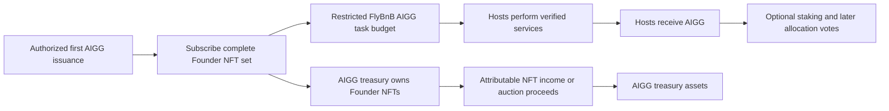
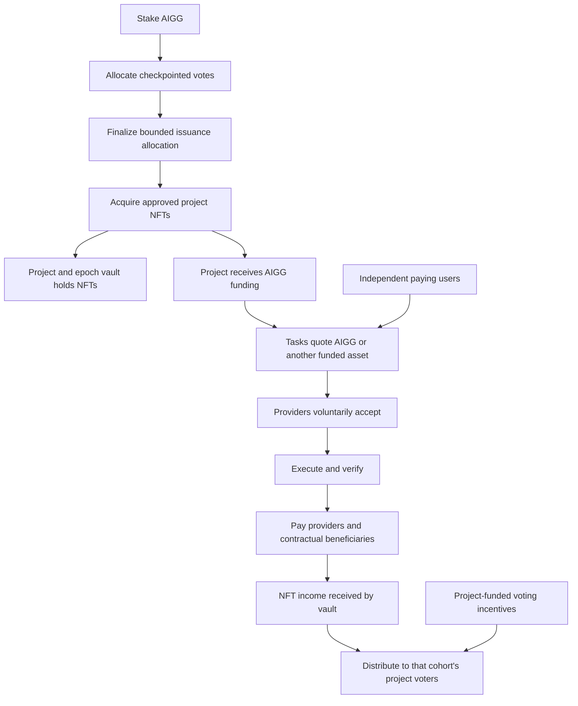

# AIGG Governance: Founder Bootstrap, Staked Voting, and NFT Returns

**Date:** 2026-09-20
**Revision:** v0.3 — Service-earned bootstrap followed by ongoing vote incentives

**Status:** Proposed design; no token issuance, governance deployment, or contract changes are authorized by this document.
**Scope:** AIGG allocation governance and its interfaces with NFT collections, task payments, and revenue distribution.
**Local inspection baseline:** repository HEAD `96e2576`, with existing unrelated working-tree changes. This is not a claim about the latest remote or deployed state.

## 1. Purpose and Agreed Direction

AIGG begins with a one-time bootstrap: the first AIGG issuance purchases all NFTs in a precisely defined FlyBnB Founder set, held by the AIGG treasury. FlyBnB uses the funding to pay hosts for accepted, verified services in AIGG. Treasury-held NFTs can generate contractual income and can be sold through disclosed auctions. This initial allocation precedes a circulating staker electorate.

After bootstrap, AIGG introduces a supplementary funding and incentive layer for aigg applications. Participants stake AIGG to vote on where a bounded issuance budget goes. Allocations purchase project NFTs. The receiving project uses the proceeds to fund tasks; providers choose whether to accept the offered payment asset and price. Stakers who vote for a project receive the associated incentives and returns under disclosed rules.

This adapts the emission-direction and vote-incentive pattern associated with Proof of Liquidity to **NFT subscription**. It does not copy Berachain's validator or BGT architecture. NFTs carry the acquired project rights; the underlying task protocol determines whether computation meets its execution specification.

The lifecycle has two distinct economic phases using the **same AIGG token**:

| Phase | Purpose | Distribution and allocation mechanism |
|---|---|---|
| Initial FlyBnB service mining | Establish the first circulating holder base through useful work | The first issuance subscribes the Founder set; hosts earn the funded AIGG by providing verified services |
| Ongoing stake-directed emissions | Let participants choose where subsequent issuance is deployed | AIGG holders stake and vote; admitted projects attract support with disclosed vote incentives and project returns; allocated issuance purchases their NFTs |

The first phase solves initial token distribution; the second provides the continuing allocation mechanism. Service mining does not permanently replace vote incentives, and later vote incentives do not require repeating the Founder launch. Projects funded in the second phase can still pay hosts for verified work with the AIGG they receive. Treasury income and Founder auctions may continue across both phases.

Project admission remains a separate control: ongoing allocation governance can begin while FlyBnB is the sole admitted project, then expand to additional approved projects. Enabling vote incentives does not itself grant permissionless registration. Voting eligibility depends on qualifying AIGG stake, not a permanent requirement that each voter personally mined their tokens in the first phase.

The following requirements are established by the product discussion:

- The first issuance purchases the complete approved Founder NFT set for the AIGG treasury; hosts earn AIGG through service delivery.
- Founder asset income and auction proceeds accrue to the treasury. They are not automatically assigned to future voters.
- After bootstrap, only staked AIGG has allocation voting power.
- Voting selects the destination of issuance; holding AIGG alone does not earn project returns.
- Returns from later vote-funded portfolios belong to the staked voters supporting the relevant project, not all token holders or all voters across projects. Founder treasury assets are a separate ownership class.
- Initially, **FlyBnB is the only admitted subnet**. Permissionless subnet creation and an open vote-incentive market are later possibilities, not launch requirements.
- NFT subscriptions and task payments support explicitly accepted assets such as AIGG, native BNB, and approved USDC deployments.
- AIGG-funded tasks may pay AIGG directly. No forced conversion to BNB is required.
- Providers independently accept or reject an asset and quote.
- Governance cannot vote an incorrect execution result into correctness.

Rules marked **proposed default** below make the draft internally concrete without implying that economic parameters have been approved. Launch-blocking choices are listed in Section 14.

## 2. Position Relative to Existing Documents and Code

This proposal extends the [system white paper](../../WHITEPAPER.md) and [economic-model discussion](../../TOKENOMICS.md). The white paper's earlier statement that no new protocol token is proposed describes the preceding architecture. This document proposes AIGG as an additional layer; it does not retroactively change implementation status or assert that the white paper has already been revised.

The inspected [FlyCollection](../../../contracts/src/FlyCollection.sol) requires native-currency `msg.value` for minting and breeding. Its royalty interface is not a per-asset ledger. [TreasuryRouter](../../../contracts/src/TreasuryRouter.sol) can forward ERC-20 balances, but that alone does not implement ERC-20 NFT subscriptions, task escrow, or multi-asset royalties.

Token contracts, stake checkpoints, allocation epochs, acquisition vaults, and cohort distributions are proposed components. Multi-asset support requires coordinated collection, task-market, accounting, and frontend changes. Existing collections may require a new version rather than an in-place upgrade. Governance stake is separate from existing provider bonds, challenge deposits, and beacon deposits.

## 3. Actors and Components

| Component or actor | Responsibility |
|---|---|
| AIGG issuance controller | Enforce the one-time Founder issuance ceiling and subsequent epoch caps within a common supply ceiling; mint only authorized acquisitions |
| Founder treasury and auction module | Hold the complete Founder set, collect attributable income, and conduct bounded auctions with proceeds returned to treasury |
| Staking and voting module | Hold stake, checkpoint voting power, enforce lock and withdrawal rules, record allocation choices |
| Admission registry | Identify approved subnets, collection addresses, acquisition adapters, accepted assets, and terms versions |
| Epoch allocator | Finalize votes and reserve each project's allocation once |
| Acquisition adapter | Execute bounded, approved NFT purchases and record receipts; no unrestricted calls |
| Project/epoch vault | Hold acquired NFTs and segregate income, refunded capital, and reward liabilities |
| Reward distributor | Credit incentives and realized proceeds to eligible historical voters, per asset |
| FlyBnB research operator | Define funded experiments, reserve delivery budgets, orchestrate tasks, publish outcomes |
| Compute providers and challengers | Accept tasks, execute or independently verify them, and use the task protocol's settlement rules |
| Initial admission administrator | Admit only FlyBnB at launch; publish actions and operate within explicitly limited permissions |

A subnet is a collection of tasks and application rules, not necessarily a separately tokenized network. Admission does not require a subnet token. A collection is an acquisition target within a subnet; a single NFT or experiment does not require its own subnet.

## 4. Asset and Funding Flow

### 4.1 Founder Bootstrap and Service-Earned Distribution

The bootstrap is a precommitted allocation, not a stake vote conducted before anyone can earn AIGG. Publish a genesis manifest containing the chain and collection version, an immutable enumeration or commitment to every Founder NFT, per-NFT purchase terms, total first issuance `G`, treasury custody address, FlyBnB funding escrow, and the native-cost funding source. “All Founders” refers only to this finite set, not all future descendants or a set the operator may expand. The proposal assumes these NFTs can be subscribed at launch; already privately owned tokens cannot be transferred into treasury without their owners agreeing to a purchase.

The first issuance is dedicated to this acquisition. `G = sum(founder subscription payments in AIGG)`. It is included in the overall authorized supply, not added outside that ceiling. No bootstrap governance vote or project-token price determines this amount. Additional team, investor, or discretionary allocations are not part of this proposed first batch. Any future introduction would need separate disclosure and would change the service-earned distribution claim.

**Proposed default:** subscriptions pay into a restricted FlyBnB research escrow, not a freely spendable operator wallet. Public task schedules define model/input identity, work scope, accepted-result conditions, AIGG prices, budget caps, deadlines, and retry rules. Hosts choose to participate; AIGG is released only for completed obligations under the task protocol, after the applicable settlement conditions. Any verification, operations, or beneficiary share must be disclosed separately from host earnings. A subscription receipt or idle address alone does not earn host rewards.

The manifest acquisition may be completed in bounded atomic batches, minting only the purchase price of each successfully received NFT. The bootstrap is complete only after the treasury owns every manifest token and the recorded payments sum to `G`. No service payouts begin from this first batch until completion; incomplete acquisition is paused or unwound under the manifest's deadline/refund policy, not silently relabeled as a smaller successful launch. Retries cannot mint twice for the same Founder. This staging avoids distributed host payouts before an incomplete acquisition can be resolved.

This is a **service-earned, fair-mining-like distribution objective**, not a claim of proven fairness or consensus mining. Assess it through public access, consistent rates for comparable work, operator independence, access to native gas/bonds, and measured reward concentration. Multiple addresses do not establish independent hosts. Prevent replayed work from earning twice unless replication is an explicitly budgeted task; disclose operator-affiliated hosts and any privileged scheduling. Correct execution alone cannot establish research usefulness.

Initial AIGG is minted at acquisition and subsequently released from escrow; each host payout is a transfer of already issued tokens, not another mint. Report total minted supply, escrowed funds, host/other distributions, and treasury recirculation separately. Governance activation requires a published distribution period and stake snapshot rule; unearned research escrow, treasury holdings, and protocol-controlled balances do not count as public host-earned voting stake. Transition does not require every experiment to finish, but it cannot rewrite existing obligations.

### 4.2 Later Stake-Directed Funding

The protocol does not automatically swap assets. An AIGG balance cannot back a BNB obligation. External users can fund BNB or USDC tasks independently of AIGG emissions; corresponding NFT income stays denominated in the asset actually received.

An NFT purchase must specify its funding split, experiment obligations, rights, and refund policy. The full purchase price is not necessarily the experiment budget. Fees, beneficiary shares, and any separate native-currency deposits must be itemized before acquisition. A provider's gas and protocol-bond requirements remain independently funded; receiving an AIGG task fee does not eliminate them.

## 5. Staking and Allocation Epochs

This section applies after the Founder bootstrap. Zero pre-launch stake does not prevent the independently authorized first issuance.

### 5.1 Voting Power

**Proposed default:** one checkpointed, locked AIGG gives one vote. No lock-duration multiplier, transferable voting position, delegation, or project-token price weighting is required at launch.

Each epoch publishes its start snapshot, voting deadline, finalization time, acquisition deadline, stake unlock boundary, and immutable terms hash. Stake must exist before the snapshot and remain non-withdrawable through the epoch's acquisition deadline. Later deposits become eligible in a later epoch. Each voter may replace allocations before the voting deadline; only the final allocation counts.

A voter's aggregate allocations cannot exceed their checkpointed stake. Splitting stake among addresses must not increase power. Tokens in a pending withdrawal that cannot meet the lock requirement are ineligible. A withdrawal requested after committing a vote cannot invalidate its lock.

### 5.2 Bounded Allocation

**Proposed default:** let `E_e` be the epoch's maximum authorized issuance, `S_e` its total eligible snapshot stake, and `v_i,e,p` voter `i`'s final allocation to project `p`.

`W_e,p = sum_i(v_i,e,p)`

`A_e,p = floor(E_e * W_e,p / S_e)`

If `S_e = 0`, no allocation is made. Each account satisfies `sum_p(v_i,e,p) <= s_i,e`, so total allocations cannot exceed `E_e`. A published quorum must also be satisfied; otherwise the entire epoch expires without issuance.

This denominator deliberately includes eligible non-voting stake: abstention and unallocated voting power leave part of the budget unissued. A small participating minority does not automatically allocate the full cap. An alternative that normalizes only over cast votes would spend the whole cap once quorum is reached; it is not the proposed launch rule.

Project purchase caps may reduce an allocation. Excess and integer rounding remain unissued and are not redistributed silently. Allocation votes cannot increase `E_e` or override the supply ceiling. Changes to the issuance schedule require a separate constitutional process with advance notice.

### 5.3 The Single-Subnet Voting Phase

After bootstrap, while FlyBnB remains the only admitted subnet, votes may support FlyBnB or leave funds unallocated. There is no competition among freely registered projects. The approved FlyBnB offer identifies the experiment batch and purchase terms; only one active offer per epoch is needed initially. Since the Founder set is already treasury-owned, later subscriptions must identify newly issuable non-Founder individuals or another explicitly approved new offer. They cannot repeatedly purchase the same treasury-held Founders to manufacture new research funding.

For example, with a maximum budget of 100,000 AIGG, 1,000 eligible staked AIGG, and 600 votes for FlyBnB, the allocation is at most 60,000 AIGG, provided quorum is met. These numbers illustrate the formula; they are not proposed token-supply parameters.

## 6. NFT Acquisition and Custody

An approved offer binds: chain and collection, adapter version, accepted payment asset, unit or maximum total price, maximum quantity, experiment scope, delivery deadline, refund terms, NFT beneficiary rights, and the receiving treasury or cohort vault. The subscription route purchases newly issued NFTs with explicit funding obligations. Secondary-market purchases are outside launch scope because their proceeds normally go to sellers rather than new research delivery.

**Proposed default:** for both authorized Founder acquisitions and later finalized vote allocations, mint AIGG only at a successful acquisition transaction, atomically with payment and verified NFT receipt. An unsuccessful transaction produces neither a lasting mint nor a purchase. For later voting epochs, partial batches are allowed under the same price and quantity bounds; expired or unspent allocation remains unissued. Founder batching instead follows the complete-set activation rule in Section 4.1. Finalization and each acquisition use unique epoch/project/offer identifiers to prevent duplicate allocation or minting.

Founder NFTs belong to the AIGG treasury. Later vote-funded NFTs belong to their project/epoch vault on behalf of its beneficiary cohort. Neither class is an operator's personal property. Later governance cannot reclassify existing cohort property as Founder treasury property. Founder auctions are an explicit part of the proposed asset-management path; sales of cohort assets additionally require their original beneficiary terms to permit them.

Historical funding attribution identifies the Founder bootstrap or the later AIGG allocation and cohort. It remains distinct from current NFT ownership, scientific authorship, and actual computation contributions.

### 6.1 Founder Treasury Returns and Auctions

The treasury may receive holder-attributable task royalties while it owns a Founder, and net proceeds when it sells that NFT. Collection-level secondary-sale royalties are a different right: holding a Founder does not automatically entitle the treasury to every trade fee in the collection. Any such revenue route must be explicitly defined in the collection terms and the configured beneficiary. Existing collection resale royalties can depend on marketplace enforcement; projected trading volume is not a guaranteed treasury receipt.

Price appreciation is an unrealized valuation change until a sale settles. A thin-market floor or related-party trade is not reliable evidence that the treasury can liquidate all Founders at that price. Track actual receipts by asset, acquisition basis, fees, remaining NFT inventory, and related-party provenance. Acquisition with newly issued AIGG is not zero economic cost, and its nominal subscription price does not independently establish an external valuation. A cross-asset return calculation must disclose its valuation method rather than adding AIGG, BNB, and USDC amounts.

**Proposed auction requirements:** publish the NFT/lot identifiers, settlement asset, reserve, opening/closing times, extension rule, bid increment, authorized fees, and treasury recipient before bidding starts. Require escrow-backed bids, atomic payment/NFT delivery, and pull-based refunds for losing bids. No qualifying bid leaves the NFT in treasury. Failed settlement preserves recoverable bidder funds and treasury ownership; retries cannot deliver or charge twice. Selling NFTs does not mint more AIGG.

Before governance handover, only the disclosed bootstrap authority may schedule auctions within the genesis mandate and published notice period; afterward, the specified treasury-governance process authorizes them. Auction operators cannot redirect proceeds. Affiliate participation, concentrations, and suspicious self-funded activity must be disclosed; a public auction alone does not prove an arm's-length price.

Settle accrued holder income at the ownership boundary under the collection's actual rules; delayed pre-sale royalties must not be silently assigned to the buyer because collection settlement failed. Receipts and sale terms need a reliable cutover or explicit disclosure of pending claims. The buyer obtains the NFT's specified future rights. Selling a Founder does not cancel funded research obligations or sell its reserved task budget.

Net Founder proceeds remain treasury assets for future authorized uses. Neither host service earnings nor later allocation votes automatically confer a redeemable pro-rata claim on that inventory. Any distribution of Founder treasury profits to stakers requires a separate prospective policy; later cohort rewards keep their own rules.

## 7. Reward Rights and Accounting

### 7.1 Cohort-Based Entitlement

These entitlements cover later vote-funded portfolios only. Founder treasury NFTs have no fictitious pre-launch voter cohort.

**Proposed default:** finalized votes create non-transferable historical entitlement for `(epoch, project)`. After successful acquisition, voter `i` has fraction:

`q_i,e,p = v_i,e,p / W_e,p`

All voters for that offer share proportionally in the actually acquired portfolio, including partial fulfillment. No purchase means no NFT-return entitlement to assets that do not exist.

Once the required stake lock ends, withdrawing principal does not erase rights already earned for that cohort. Future votes do not obtain earlier NFTs' income. This is a proposed historical-cohort model, rather than a rolling pool where current stakers receive every past investment's income. It requires explicit approval before implementation.

Existing rights last while the cohort owns assets or has unpaid receivables. Delayed royalties remain claimable; an epoch's acquisition deadline is not a reward expiration date. A future change cannot move historical rights to another cohort without those original terms permitting it.

### 7.2 Separate Sources, Separate Ledgers

| Receipt | Treatment |
|---|---|
| Project-funded voting incentive | Distributed under its published eligibility and release conditions; not labeled investment profit |
| Task royalty from an independent customer | Realized NFT income, credited in the received asset |
| Royalty from AIGG-funded research | Real receipt but identified as subsidy recirculation, not external revenue |
| Founder NFT income and auction proceeds | Treasury receipts, separately tracked from later voter-cohort portfolios |
| Later cohort NFT sale proceeds, if permitted | Separate capital recovery from realized gain; distribution follows original cohort sale terms |
| Refunded AIGG acquisition principal | Returned to a restricted issuance recovery account, not distributed as voter yield |
| Unsolicited token transfers | Quarantined until provenance and accounting treatment are established |
| Market price appreciation | Informational valuation only, never a claimable token balance |

Source attribution should use known funding and task links, flag related-party activity, and mark unresolved provenance as unknown. BNB or USDC payment alone is not proof of independent demand.

**Proposed default:** for later vote-funded assets, the distributable NFT income belongs entirely to that project's cohort after collection-defined upstream splits and explicitly disclosed costs. There is no automatic diversion to all AIGG holders or a new treasury profit share. Operational costs should normally have a separate approved budget; an operator cannot invent deductions after voting.

For each received asset `a`, cumulative distributable income `R_e,p,a` produces:

`claimable_i,e,p,a = floor(R_e,p,a * v_i,e,p / W_e,p) - alreadyClaimed_i,e,p,a`

Claims use cumulative accounting so rounding does not depend on payment frequency. Residual dust stays in the vault unless original terms specify a terminal treatment. Each asset is solvent independently: cumulative claims cannot exceed distributable receipts. Repeated collection or claims cannot duplicate income. Distribution uses pull-based claims, not an unbounded loop over voters.

### 7.3 Voting Incentives

Vote incentives are the intended ongoing allocation mechanism after the service-earned bootstrap. Open project competition is deferred until admission expands; these are separate milestones. Participating admitted projects may escrow approved tokens to attract votes once the incentive module is enabled. Offers must be funded, immutable for the relevant epoch, and explicit about whether payment depends only on votes or also on successful acquisition or delivery. The proposed launch-compatible default conditions any incentive on a finalized, successfully funded offer, with a disclosed partial-acquisition scaling rule.

A project issuing its own reward token can provide incentives without creating external economic value. Such a reward may pay even when the investment eventually fails. It must therefore remain separate from NFT operating returns and cannot be presented as proof of successful project selection.

## 8. Multi-Asset Subscriptions and Task Settlement

Identify an asset by chain and contract address, using a defined sentinel for native BNB. A ticker is not an identity. USDC support means an explicitly approved deployment, not every token named USDC.

Each collection offer and task states its asset, integer amount, deadline, and terms. NFT acquisition, task escrow, provider payouts, royalty collection, and refunds require asset-specific ledgers. The same project may support several assets, but each obligation is backed in its own currency.

Providers publish or enforce accepted assets and minimum quotes. Declining a task carries no penalty. Accepting a task invokes its agreed performance and dispute obligations. No accepted supply means the experiment remains pending; only a preauthorized repricing, extension, alternative funding source, or cancellation may change that state.

Launch support should use reviewed assets with ordinary transfer behavior; fee-on-transfer and rebasing assets are excluded from the initial design. Exact receipt checks, safe transfers, reentrancy protection, and liability accounting are requirements. A token freeze or failed transfer leaves a recoverable liability and must not block unrelated assets or recipients.

Native-currency bonds and gas need explicit reserves or sponsorship. Existing issuance-funded NFTs that automatically create provider bonds cannot silently debit AIGG as if it were BNB. The acquisition adapter must identify and satisfy each separate requirement or reject the offer.

## 9. Failure, Refund, and Exit Rules

| Event | Required outcome |
|---|---|
| No eligible stake or quorum failure in later voting epochs | No epoch issuance; the separately authorized Founder bootstrap is not governed by this rule |
| Founder acquisition incomplete | No bootstrap completion or service payouts; retry or unwind under the genesis manifest |
| Nobody supports FlyBnB | No forced allocation to the sole admitted project |
| Later epoch purchase fails or deadline expires | Failed portion remains unissued; successful purchases remain attributed to their cohort |
| Founder auction attracts no qualifying bid | Retain the NFT; do not book sale proceeds or realized profit |
| No providers accept the task asset/price | Pending until the disclosed task deadline; then apply the funded offer's cancellation or extension rules |
| Incorrect or disputed output | Follow the task protocol; governance cannot bypass verification to release task rewards |
| Delivery fails after NFT acquisition | Apply the offer's enforceable refund terms; report unrecoverable loss if funding was spent and cannot be recovered |
| NFT purchase is refunded | Return recovered acquisition principal to the restricted issuance account; burn it where supported, otherwise make it non-spendable pending an explicitly authorized recovery procedure |
| Project is removed from admission | Stop future allocations; preserve existing NFTs, claims, task liabilities, and historical records |
| Critical vulnerability | Pause new voting/acquisitions or affected operations; isolate the minimum necessary scope and preserve recorded rights |

Refunded issuance is not automatically reallocated in a later epoch and must not circumvent mint caps. An NFT cannot be both fully refunded and retained as an unrestricted duplicate benefit unless that outcome was explicitly priced into the offer. Refund state must identify which NFT rights are cancelled, returned, or preserved.

Project failure does not automatically slash a voter's staked principal. Voters bear token exposure, dilution, the lock period, and the loss of expected project returns. They may still have earned a separately funded voting incentive. Honest allocation error is distinct from objectively provable protocol misconduct.

## 10. Governance Authority and Risk Boundaries

Launch admission is permissioned and limited to FlyBnB. The named bootstrap authority, signing threshold, timelock, and emergency powers must be published before deployment. Its powers cover the precommitted Founder acquisition, bounded treasury auctions, future admission, approved adapters and assets, and permitted future parameter changes. First issuance and auctions cannot be enlarged or redirected through an undocumented administrative exception. It must not arbitrarily seize stake, historical NFT portfolios, or accrued rewards.

Emission-direction voting is separate from constitutional decisions about supply, admission, upgrades, and emergency operation. Routine allocation votes cannot modify their own snapshot or create additional issuance. Constitutional governance may begin with a disclosed multisig; a token-governed replacement is a separate later design.

The incentive hypothesis is that stake exposure plus project-specific returns encourages useful allocation. It does not guarantee it. A voter may accept short-term rewards while all holders bear dilution. Staking does not insure against network-wide losses, and exact execution does not establish scientific usefulness.

Initially, restricted admission reduces exposure to arbitrary project-token incentives. Later expansion should preserve bounded emissions, project caps, source-separated reporting, precommitted terms, and explicit delivery obligations. Project-token price must not multiply voting power or mechanically determine issuance. A thinly traded NFT floor must not become an emission-allocation oracle.

Security reviews must cover borrowed stake held through the lock, last-minute vote incentives, vote concentration, related-party NFT pricing, duplicate acquisitions, royalty misattribution, and colluding providers. Holding stake through a snapshot alone is not sufficient protection against short-term borrowing; duration and acquisition settlement matter.

## 11. Alternatives and Selected Direction

| Alternative | Benefit | Decision |
|---|---|---|
| Direct emissions to providers without NFT acquisition | Fewer contracts and direct supply incentives | Does not capture the NFT rights and project-specific return relationship requested here |
| Founder treasury portfolio | Provides pre-vote funding, retained project rights, and an auction route | Selected for the first issuance; treasury income is not automatically paid to current stakers |
| Rolling common pool for all later allocations | Simpler ongoing membership model | Not selected for vote-funded acquisitions because it disconnects returns from the original project vote |
| Project/epoch NFT portfolios and historical voter entitlements | Traceable funding, ownership, and returns tied to a choice | Selected proposed default; requires cohort accounting and longer-lived claims |

The design reuses NFT acquisition as the funding route. It does not require an alpha token per subnet, an AMM, token-price oracles, cross-chain settlement, transferable vote receipts, or a general NFT trading strategy. Bounded sales of treasury-held Founders are explicitly in scope.

## 12. Delivery Stages

| Stage | Scope | Exit evidence |
|---|---|---|
| G0: Economic specification | Approve the complete Founder manifest, first issuance, host distribution, treasury auction mandate, and later cohort rights | Accounting examples cover complete-set acquisition, service earnings, treasury income, auctions, and later voting |
| G1: Multi-asset foundation | Versioned subscription and task-payment interfaces for approved assets | AIGG-denominated test flow and native-currency regression flow settle, distribute royalties, and refund without mixing balances |
| G2a: Founder bootstrap | Complete-set subscription, treasury custody, funded service schedule, public host participation | Every Founder accounted for; verified hosts earn AIGG; no privileged undisclosed payouts or repeated minting |
| G2b: Treasury asset management | Holder-income collection and bounded Founder auctions | Correct income cutover, bid/refund accounting, and net proceeds paid to treasury; research obligations survive sales |
| G2c: Single-subnet governance | After distribution, stake checkpoints, epochs, FlyBnB-only additional acquisition, and cohort claims | Host-earned AIGG can stake and vote; later asset returns pay the correct historical cohort without taking Founder assets |
| G3: Operational validation | Repeated cohorts, monitoring, recovery, and independent provider participation | Published delivery rates, source-separated income, outstanding obligations, failures, and concentration |
| G4: Admitted competition | Additional approved subnets and funded vote incentives | Admission and cap policies validated; reward offers and revenue attribution withstand adversarial review |
| G5: Optional open participation | Consider broader registration and competition | Separate governance approval based on evidence; not automatic progression |

AIGG issuance and mainnet activation require a separate implementation and deployment decision. This document authorizes neither.

## 13. Required Invariants and Acceptance Scenarios

Before implementation release, verify both bootstrap and later governance paths:

1. No unstaked balance, post-snapshot deposit, or duplicated address accounting increases an epoch's voting power.
2. Replacement votes overwrite previous allocations; aggregate project votes never exceed eligible stake.
3. Locks survive withdrawal requests until the published boundary; stake becomes withdrawable afterward without erasing historical claims.
4. In later voting epochs, zero votes, failed quorum, and abstentions produce the specified unissued balance.
5. Founder issuance never exceeds its manifest cap; subsequent minting never exceeds finalized epoch allocations; their sum respects global authorization. Finalization and purchase retries cannot double mint.
6. Every successful purchase pays the permitted asset and price and delivers the expected NFT to the correct vault.
7. Partial purchases allocate historical interests consistently; a later epoch cannot inherit the earlier cohort's income.
8. AIGG, BNB, and approved ERC-20 balances, royalties, refunds, and claims remain separately solvent.
9. Duplicate income collection and repeated claims cannot overpay; a failing recipient cannot block others.
10. Provider rejection does not incur penalties; accepted tasks obey their signed terms and verification rules.
11. Refunded purchase capital cannot become apparent yield or an unrestricted extra issuance budget.
12. Removal, pause, restart, and upgrade paths preserve historical entitlements and outstanding delivery obligations.
13. A complete example distinguishes external payments, funded-task recirculation, project-token incentives, principal recovery, and unrealized appreciation.
14. Every manifest Founder is received before bootstrap activation; duplicate token identifiers or incomplete batches cannot release host rewards.
15. Hosts receive escrow transfers for verified, authorized work; payout retries and replayed tasks cannot create extra rewards. Protocol-controlled budgets cannot vote as earned host stake.
16. Auctions enforce the committed lot, asset, reserve, and deadline; losing bids are recoverable, proceeds reach treasury, and NFT delivery cannot repeat.
17. Founder income never enters a later cohort by default; a sale preserves accrued-income attribution and outstanding research budgets.

Documentation validation is not evidence these contract properties already hold.

## 14. Decisions Required Before Implementation

The product direction is established; the following are intentionally unresolved launch parameters:

| Decision | Proposed default or required selection |
|---|---|
| Token supply and mint authority | Publish supply ceiling, first issuance `G`, complete Founder manifest, later epoch caps, and exact authorized minters; no numeric tokenomics assumed |
| Service-earned distribution | Publish task eligibility, AIGG rates, host and non-host shares, native-cost funding, access policy, and governance-activation threshold/time |
| Founder auctions | Select auction format, reserve-setting method, accepted assets, notice period, authority, fees, income cutover, and proceeds policy |
| Voting cadence and quorum | Choose epoch duration, quorum denominator/threshold, voting window, acquisition deadline, and minimum lock duration |
| Historical reward rights | Approve the later cohort model in Section 7, including post-withdrawal rights; any Founder treasury distribution is a separate decision |
| Acquisition terms | Choose FlyBnB collection version, funding split, price, quantities, experiment scope, refund enforcement, and task deadlines |
| Capital recovery | Select burn or restricted recovery implementation, including treatment of already incurred costs |
| Supported assets | Publish chain, native sentinel, AIGG address, approved USDC address if included, and transfer-behavior policy |
| Bootstrap authority | Name administrator, threshold, timelock, pause scope, upgrade limits, and transition process |
| Operating costs | Identify who funds gas, relayers, auditors, native bonds, and storage; do not assume AIGG receipts pay native liabilities |
| Vote incentives | Defer open incentives at launch; before enabling them, fix eligibility, release conditions, partial-fill scaling, and recovery |

These decisions block a deployment-ready contract specification, not publication of this architecture draft.

## 15. References

- [System white paper](../../WHITEPAPER.md): overall architecture and comparison with Bittensor; its no-token premise predates this proposal.
- [Tokenomics discussion](../../TOKENOMICS.md): existing collection, bonding, and payment context; proposed governance is additional.
- [FlyBnB contribution policy](https://github.com/jianmliu/aigg-bnb/blob/09c9de9/docs/flybnb/CREDIT.md): research contributions and attribution are distinct from financial entitlements.
- [Berachain: add incentives to a reward vault](https://docs.berachain.com/learn/guides/add-incentives-for-reward-vault) and [validator incentive commission](https://docs.berachain.com/validators/guides/manage-incentives-commission): reference for the incentive-direction pattern, reviewed 2026-09-20. AIGG does not claim protocol compatibility or reproduce Berachain's exact mechanism.
